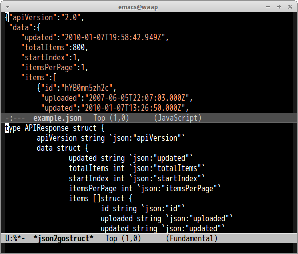

# json2gostruct.el

Convert JSON to golang struct definition

## Screenshot

## Usage

#### `M-x json2gostruct`

Convert JSON of current buffer and generate golang struct definition corresponding to it.
